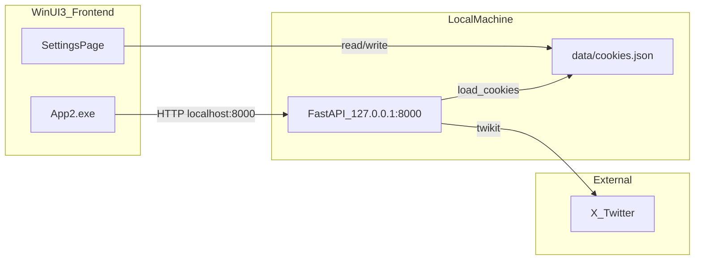

# WinUI-3-twikit

**English summary:** A WinUI 3 desktop client for X (Twitter), backed by a local FastAPI server and [twikit](https://github.com/yukari-557fd8/twikit) (fork; required). Requires Windows 10+, .NET 8 SDK, Python 3.10–3.12 (recommended), and Visual Studio 2022 or later with the WinUI workload. Quick start: `git clone` → `pip install -r requirements.txt` → copy `data/cookies.example.json` to `data/cookies.json` and fill in your cookies.

---

WinUI 3 で動作する X（旧 Twitter）クライアントです。フロントエンド（C# / WinUI 3）とバックエンド（Python / FastAPI + [twikit](https://github.com/yukari-557fd8/twikit)）の二層構成で、ローカルの `http://localhost:8000` 経由で通信します。

> **twikit について:** 本プロジェクトでは [yukari-557fd8/twikit](https://github.com/yukari-557fd8/twikit) フォークを使用します。PyPI 版や他のフォークは使用しないでください。[requirements.txt](requirements.txt) から自動的にこのリポジトリがインストールされます。

> **注意:** これは非公式クライアントです。X の仕様変更により予告なく動作しなくなる可能性があります。利用は自己責任でお願いします。

## 機能

| 画面 | 機能 |
|---|---|
| ツイート | テキスト投稿（メディア添付可） |
| ホーム | おすすめ / 最新タイムライン、いいね・リツイート・返信 |
| 検索 | ツイート検索 |
| 通知 | 通知一覧 |
| プロフィール | ログイン中アカウントのプロフィール表示 |
| 設定 | `auth_token` / `ct0` の入力・保存 |

## アーキテクチャ



- アプリ起動時に `backend/api.py` を自動起動（`ServerManager.cs` が `uvicorn api:app` を実行）
- 認証情報は `data/cookies.json` に保存（フロントエンドの設定画面と Python バックエンドで共有）
- 環境変数 `COOKIES_FILE` で cookie ファイルのパスを上書き可能

## 必要条件

| 項目 | 内容 |
|---|---|
| OS | Windows 10 バージョン 1809 以降 |
| .NET | **.NET 8 SDK**（必須。プロジェクトは `net8.0` をターゲット） |
| IDE | **Visual Studio 2022 以降** +「Windows アプリ開発」ワークロード（WinUI 3） |
| Python | **3.10 〜 3.12 推奨**（twikit フォークは 3.8 以上に対応） |
| Python パッケージ | [requirements.txt](requirements.txt) 参照（twikit は [yukari-557fd8/twikit](https://github.com/yukari-557fd8/twikit) から取得） |
| PATH | `uvicorn` コマンドが使えること |

### 動作確認環境（開発時）

| 項目 | バージョン |
|---|---|
| Visual Studio | 2026 |
| Python | 3.12 |
| .NET SDK | 8 以降 |

### 環境差について

Visual Studio や Python の**マイナーバージョンが開発環境と異なっても**、上記の必要条件が揃っていれば動作する想定です。失敗の多くはバージョン差ではなく、次の不足が原因です。

- .NET 8 SDK が未インストール
- WinUI 3 ワークロードが未インストール
- `pip install -r requirements.txt` 未実行、または PyPI 版 twikit を入れてしまった
- `uvicorn` が PATH にない
- `data/cookies.json` が未作成、またはトークン期限切れ

> **補足:** Python 3.13 は動作する可能性がありますが、依存ライブラリの互換性が未検証のため推奨対象外です。

## リポジトリ構成

```
WinUI-3-twikit/
├── backend/              # FastAPI (api.py, twikit_client.py)
├── scripts/              # twikit 操作モジュール
├── frontend/
│   └── App2/             # WinUI 3 アプリ本体
├── data/
│   └── cookies.example.json  # 認証情報テンプレート
├── static/               # favicon 等
└── requirements.txt
```

## セットアップ

### 1. リポジトリの取得

```powershell
git clone https://github.com/yukari-557fd8/WinUI-3-twikit.git
cd WinUI-3-twikit
```

### 2. Python 依存関係のインストール

```powershell
pip install -r requirements.txt
```

`requirements.txt` には twikit が GitHub フォーク（[yukari-557fd8/twikit](https://github.com/yukari-557fd8/twikit)）からインストールされるよう指定されています。`pip install twikit` だけでインストールしないでください。

### 3. 認証情報の準備

```powershell
copy data\cookies.example.json data\cookies.json
```

`auth_token` と `ct0` は、ブラウザで x.com にログインした状態で取得します。

1. ブラウザの開発者ツールを開く（F12）
2. **Application**（または **ストレージ**）→ **Cookies** → `https://x.com`
3. `auth_token` と `ct0` の値をコピー
4. 次のいずれかの方法で設定する
   - `data/cookies.json` を直接編集して貼り付け
   - アプリの **設定** 画面に入力して **適用** をクリック

`cookies.json` の形式:

```json
{
  "auth_token": "your_auth_token_here",
  "ct0": "your_ct0_here"
}
```

> **重要:** `data/cookies.json` にはログイン情報が含まれます。**Git に commit しないでください**（`.gitignore` で除外済み）。

## 起動方法

### 方法 A: Visual Studio（推奨）

1. [frontend/App2.slnx](frontend/App2.slnx) を Visual Studio 2022 以降で開く
2. スタートアッププロジェクトを **App2 (Package)** に設定
3. プラットフォーム **x64**、構成 **Debug** で実行

### 方法 B: コマンドライン

```powershell
dotnet build frontend\App2\App2.csproj -c Debug -p:Platform=x64
```

ビルド後、Visual Studio から実行するか、生成された `App2.exe` を起動します。

### 起動時の挙動

- アプリが `backend/api.py` を自動起動します
- 左ペイン下部に `API Server: Running` と表示されれば API は正常です
- フロントエンドは `http://localhost:8000` に接続します

### 方法 C: API を手動起動（トラブルシュート用）

```powershell
cd backend
uvicorn api:app --host 127.0.0.1 --port 8000
```

## トラブルシューティング

| 症状 | 原因 | 対処 |
|---|---|---|
| ビルドエラー（WinUI / SDK 関連） | .NET 8 SDK または WinUI ワークロード未導入 | [.NET 8 SDK](https://dotnet.microsoft.com/download/dotnet/8.0) をインストールし、VS インストーラーで「Windows アプリ開発」を追加 |
| `backend/api.py not found` | リポジトリ外から exe を直接起動している | clone したリポジトリ内で VS / dotnet からビルド・実行する |
| `Cookiesファイルが見つかりません` | `data/cookies.json` が未作成 | `cookies.example.json` をコピーして値を入力する |
| `API Server: Failed to Start` | uvicorn が未インストール、または PATH 未設定 | `pip install -r requirements.txt` を実行し、ターミナルを再起動する |
| `API Server: Already Running` | ポート 8000 が既に使用中 | 既存プロセスを終了するか、そのまま利用する |
| タイムラインが空 / エラー | トークンの期限切れ | ブラウザから cookie を再取得し、設定画面で更新する |
| `pip install` で twikit が失敗 | Git からの取得失敗、または PyPI 版を使用 | `pip install -r requirements.txt` でフォークを指定してインストールする |

## セキュリティ

- `auth_token` と `ct0` はパスワードと同等の秘密情報です
- 公開リポジトリやスクリーンショットに含めないでください
- トークンが漏洩した場合は、X 側でセッションを無効化し、再取得してください

## ライセンス・免責

本プロジェクトは非公式のクライアントです。X の利用規約および関連法令を遵守した上でご利用ください。作者は本ソフトウェアの利用によって生じた損害について一切の責任を負いません。

## 開発メモ

- 開発環境: Visual Studio 2026 + Python 3.12 + .NET 8 SDK で動作確認済み
- twikit は必ず [https://github.com/yukari-557fd8/twikit](https://github.com/yukari-557fd8/twikit) を使用する（`requirements.txt` に Git URL で固定済み）
- cookie ファイルのパスは環境変数 `COOKIES_FILE` で変更できます（デフォルト: `data/cookies.json`）
- Python バックエンドの作業ディレクトリは `backend/` です。手動で uvicorn を起動する場合も `backend/` から実行してください
- フロントエンドは Windows App SDK 2.2 / .NET 8 を使用（[frontend/App2/App2.csproj](frontend/App2/App2.csproj)）